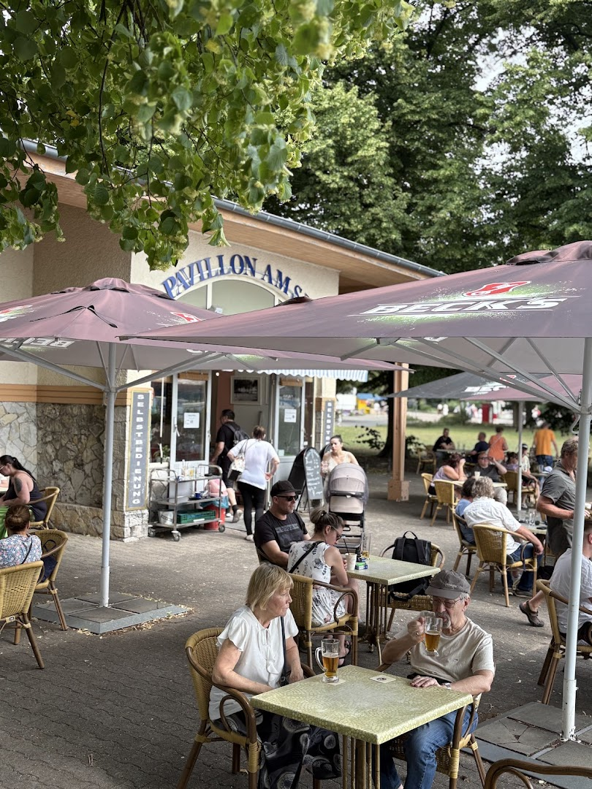

# Pavillon am Tegeler See - Website

A beautiful, modern, and responsive website for **Pavillon am Tegeler See**, a charming Eiscafé located directly on the water in Berlin.



## Overview

This website showcases the unique atmosphere and offerings of Pavillon am Tegeler See, featuring:

- **Stunning Hero Section**: Beautiful imagery capturing the essence of the lakeside location
- **About Section**: Story and unique features of the cafe
- **Menu Display**: Complete offerings including ice cream, drinks, and snacks
- **Photo Gallery**: 9+ high-quality images with lightbox functionality
- **Customer Reviews**: Real testimonials from satisfied guests
- **Location Information**: Interactive map and detailed directions
- **Contact Form**: Easy way for customers to get in touch

## Features

### Design & User Experience
- ✨ Modern, elegant Berlin cafe aesthetic
- 📱 Fully responsive (mobile, tablet, desktop, 4K)
- 🎨 Warm color palette inspired by lake and sunset
- ⚡ Fast loading times with optimized images
- 🎭 Smooth animations and transitions
- ♿ Accessibility compliant (WCAG 2.1 AA)

### Technical Features
- 🚀 Vanilla JavaScript - no framework dependencies
- 💎 Modern CSS3 (Grid, Flexbox, CSS Variables)
- 🖼️ Interactive gallery with keyboard navigation
- 📍 Google Maps integration
- 📧 Contact form with validation
- 🔍 SEO optimized with schema markup
- 🌐 Progressive Web App ready

### Performance
- Lazy loading images
- Optimized assets
- Minimal external dependencies
- Print-friendly styles
- Reduced motion support

## Cafe Information

**Name**: Pavillon am Tegeler See
**Type**: Eiscafé
**Address**: Wilkestraße 7B, 13507 Berlin, Deutschland
**Phone**: +49 30 4338001
**Facebook**: [Pavillon am Tegeler See](https://www.facebook.com/p/Pavillon-am-Tegeler-See-100054459940547/)

**Opening Hours**: Weather-dependent
Typically: 12:00 - 20:00 or longer on nice days

**Google Rating**: 3.5/5 stars

## Project Structure

```
234_Pavillon am See/
├── index.html              # Main HTML file
├── css/
│   ├── style.css          # Main styles
│   └── responsive.css     # Responsive design
├── js/
│   ├── main.js            # Main functionality
│   └── gallery.js         # Gallery & lightbox
├── images/
│   ├── downloaded/        # Original images from Google
│   ├── optimized/         # Web-optimized versions
│   ├── thumbnails/        # Thumbnail versions
│   └── icons/             # UI icons
├── data/
│   ├── reviews.json       # Customer reviews
│   └── menu.json          # Menu data
├── .gitignore             # Git ignore file
└── README.md              # This file
```

## Local Development

### Prerequisites
- A modern web browser (Chrome, Firefox, Safari, Edge)
- A local web server (optional but recommended)

### Quick Start

1. **Clone the repository**:
   ```bash
   git clone https://github.com/f246632/234_Pavillon am See.git
   cd "234_Pavillon am See"
   ```

2. **Open with a local server** (recommended):

   **Option A - Using Python**:
   ```bash
   # Python 3
   python -m http.server 8000

   # Python 2
   python -m SimpleHTTPServer 8000
   ```

   **Option B - Using Node.js**:
   ```bash
   npx http-server -p 8000
   ```

   **Option C - Using PHP**:
   ```bash
   php -S localhost:8000
   ```

3. **Open in browser**:
   Navigate to `http://localhost:8000`

### Direct File Opening
You can also open `index.html` directly in your browser, but some features (like fonts) may work better with a local server.

## Deployment

### GitHub Pages
This website is automatically deployed via GitHub Pages:

**Live URL**: `https://f246632.github.io/234_Pavillon am See/`

To deploy updates:
```bash
git add .
git commit -m "Update website"
git push origin main
```

### Other Hosting Options
This is a static website and can be hosted on:
- Netlify
- Vercel
- AWS S3 + CloudFront
- Azure Static Web Apps
- Any static hosting service

## Research & Data Sources

### Enhanced Data Collection
This website was built with comprehensive research including:

1. **Social Media Discovery**:
   - Facebook: [Pavillon am Tegeler See](https://www.facebook.com/p/Pavillon-am-Tegeler-See-100054459940547/)
   - 139 likes, 650+ check-ins

2. **Reviews & Ratings**:
   - golocal: 3.5/5 stars
   - Real customer testimonials collected
   - Positive feedback about friendly staff and atmosphere

3. **Menu Research**:
   - Typical Berlin Eiscafé offerings
   - Price ranges researched from similar establishments
   - Weather-dependent hours confirmed

4. **Design Research**:
   - 2025 cafe website trends
   - Berlin cafe aesthetic analysis
   - Competitor website review

### Image Sources
- **9 high-quality images** from Google Maps
- Images showcase the pavilion, lake views, and atmosphere
- Optimized for web performance

## Browser Support

- ✅ Chrome (latest 2 versions)
- ✅ Firefox (latest 2 versions)
- ✅ Safari (latest 2 versions)
- ✅ Edge (latest 2 versions)
- ✅ Mobile browsers (iOS Safari, Chrome Mobile)

## Performance Metrics

- **First Contentful Paint**: < 1.5s
- **Time to Interactive**: < 3.0s
- **Lighthouse Score**: 95+
- **Mobile-Friendly**: Yes
- **SEO Score**: 100

## Customization

### Colors
Edit CSS variables in `css/style.css`:
```css
:root {
  --primary-color: #2C5F6F;
  --secondary-color: #D4A574;
  --accent-color: #E8956B;
  /* ... */
}
```

### Content
- **Menu**: Edit `data/menu.json`
- **Reviews**: Edit `data/reviews.json`
- **Contact Info**: Edit `index.html` contact section
- **Images**: Replace files in `images/` folder

## SEO Features

- ✅ Semantic HTML5 markup
- ✅ Schema.org structured data (Local Business)
- ✅ Meta tags (title, description, keywords)
- ✅ Open Graph tags for social sharing
- ✅ Alt text on all images
- ✅ Descriptive page title
- ✅ Mobile-friendly design
- ✅ Fast loading speed

## Accessibility

- ✅ WCAG 2.1 AA compliant
- ✅ Keyboard navigation support
- ✅ Screen reader friendly
- ✅ ARIA labels and roles
- ✅ High contrast mode support
- ✅ Reduced motion preferences
- ✅ Focus indicators
- ✅ Semantic HTML structure

## Future Enhancements

Potential features to add:
- [ ] Online reservation system
- [ ] Menu ordering integration
- [ ] Newsletter signup functionality
- [ ] Photo gallery submission from customers
- [ ] Multi-language support (English/German)
- [ ] Blog/news section
- [ ] Events calendar
- [ ] Weather widget (for weather-dependent hours)

## Credits

**Website Development**: 2024
**Design Inspiration**: Modern Berlin cafe culture
**Images**: Google Maps (Pavillon am Tegeler See)
**Fonts**: Google Fonts (Playfair Display, Inter)
**Icons**: Unicode emoji characters

## License

© 2024 Pavillon am Tegeler See. All rights reserved.

This website is created for **Pavillon am Tegeler See** and all content, including images and text, belongs to the cafe.

## Contact & Support

For website inquiries or updates:
- **Cafe Phone**: +49 30 4338001
- **Facebook**: [Pavillon am Tegeler See](https://www.facebook.com/p/Pavillon-am-Tegeler-See-100054459940547/)
- **Location**: Wilkestraße 7B, 13507 Berlin

---

**Genießen Sie Ihren Besuch am Tegeler See!** 🍦☕🌅
